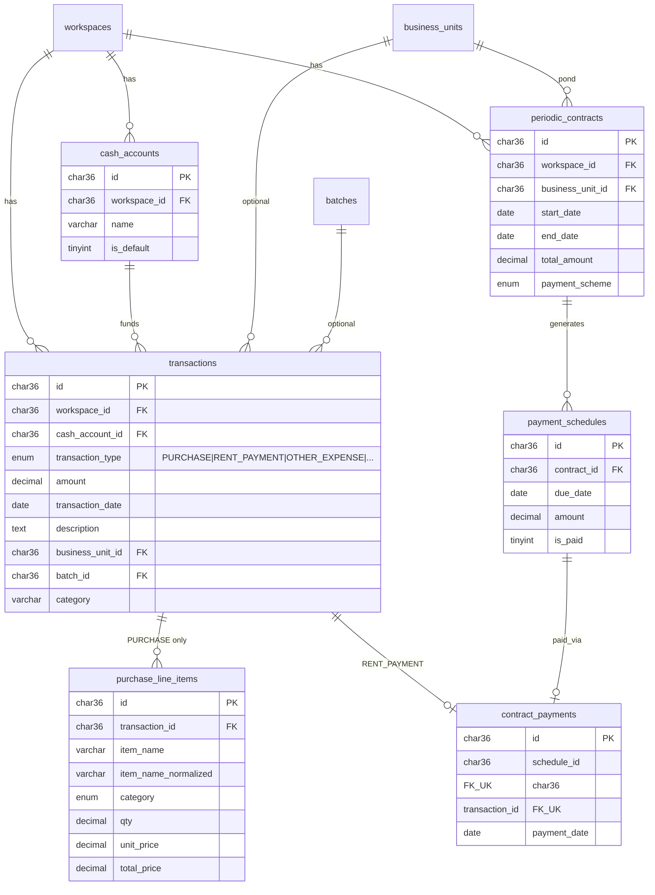
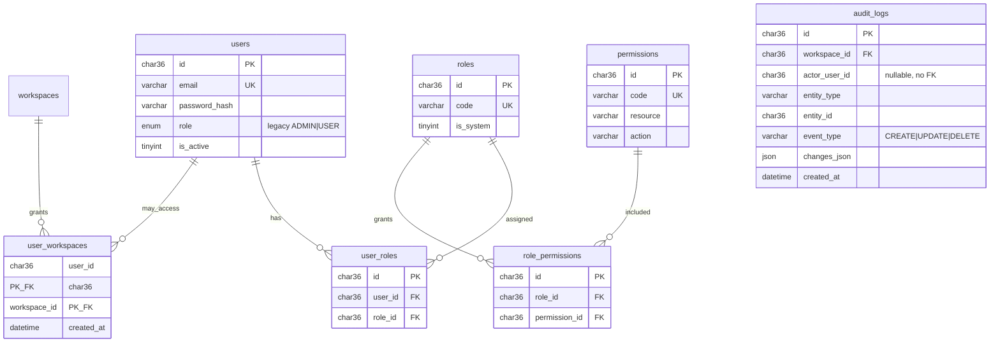

# ERD — Database Pencatatan Usaha

**Sumber kebenaran skema:** file berurutan di [`backend/internal/migrate/migrations/`](../../backend/internal/migrate/migrations/).  
Setiap start API, `migrate.Up` menjalankan ulang semua `.up.sql` (idempotent: `CREATE TABLE IF NOT EXISTS`, dll.).

**MySQL 8.4** · charset `utf8mb4` · PK umumnya `CHAR(36)` (UUID).

Aturan bisnis transaksi & audit: [BRD §9 BR-G](../../BRD.md) · workspace: [BRD §9 BR-H](../../BRD.md) · kontrak: [finance-transactions.md](../features/finance-transactions.md), [workspace-user-access.md](../features/workspace-user-access.md).

---

## Ringkasan migrasi

| File | Tabel / perubahan |
|------|-------------------|
| `000001_init` | `workspaces`, `business_units`, `batches`, `water_quality_logs` |
| `000002_auth` | `users` |
| `000003_finance` | `cash_accounts`, `transactions`, `purchase_line_items` |
| `000004_workspace_settings` | `workspace_settings` |
| `000005_rbac` | `permissions`, `roles`, `role_permissions`, `user_roles` |
| `000006_rent_contracts` | `periodic_contracts`, `payment_schedules`, `contract_payments` |
| `000007_audit_logs` | `audit_logs` |
| `000008_personal_workspace` | seed workspace `PERSONAL` + akun kas pribadi |
| `000009_user_workspaces` | `user_workspaces` — membership user ↔ workspace |
| `000010_operational_units` | `operational_units` — master unit template `generic` |
| *(runtime)* `ensureTransactionOperationalUnitID` | kolom `transactions.operational_unit_id` + FK jika belum ada |
| *(runtime)* `migrate.ensureBusinessUnitWaterQualityConfig` | kolom `business_units.water_quality_config` (JSON) jika belum ada |

**Belum ada migrasi** (hanya di BRD / `TECHNICAL_SPEC` §4 target): `consumable_lots`, `distribution_schemes`, `distribution_records`.

---

## Diagram — inti workspace & operasional

```mermaid
erDiagram
    workspaces ||--o{ business_units : contains
    workspaces ||--o{ batches : contains
    workspaces ||--o{ workspace_settings : has
    workspaces ||--o{ water_quality_logs : contains
    workspaces ||--o{ audit_logs : contains

    business_units ||--o{ batches : optional
    business_units ||--o{ water_quality_logs : measures

    batches ||--o{ water_quality_logs : optional

    workspaces {
        char36 id PK
        varchar name
        enum type "BUSINESS|PERSONAL"
        varchar template_id
        datetime created_at
        datetime updated_at
    }

    business_units {
        char36 id PK
        char36 workspace_id FK
        enum unit_type "POND"
        varchar name
        enum status "ACTIVE|INACTIVE"
        json water_quality_config "runtime column"
    }

    batches {
        char36 id PK
        char36 workspace_id FK
        char36 business_unit_id FK
        varchar name
        enum status "ACTIVE|COMPLETED"
    }

    workspace_settings {
        char36 workspace_id PK_FK
        varchar setting_key PK
        json value_json
    }

    water_quality_logs {
        char36 id PK
        char36 workspace_id FK
        char36 business_unit_id FK
        char36 batch_id FK
        datetime measured_at
        decimal ammonia_ppm
        decimal ph
        text notes
    }
```

---

## Diagram — keuangan & sewa

Semua arus uang operasional MVP berujung ke **`transactions`**.  
Hapus transaksi `PURCHASE` → `purchase_line_items` ikut (`ON DELETE CASCADE`).  
Hapus transaksi `RENT_PAYMENT` yang sudah dibayar → **diblokir** oleh `contract_payments.transaction_id` (tanpa `ON DELETE CASCADE`).



---

## Diagram — auth, RBAC, audit



**Catatan `audit_logs`:** `actor_user_id` mengacu ke `users.id` secara logis; FK eksplisit belum dipasang agar log tetap tersimpan jika user dihapus/nonaktif.

---

## Relasi penting (evaluasi perubahan skema)

| Dari | Ke | On delete | Implikasi |
|------|-----|-----------|-----------|
| `transactions` | `purchase_line_items` | CASCADE | Hapus pembelian = hapus baris nota |
| `contract_payments` | `transactions` | RESTRICT (default) | Jangan hapus transaksi sewa dari API umum |
| `transactions` | `cash_accounts` | RESTRICT | Hapus kas hanya jika tidak ada transaksi |
| `business_units` | `transactions` | CASCADE (kolam) | Hapus kolam = hapus transaksi terkait kolam |
| `workspaces` | `audit_logs` | CASCADE | Hapus workspace = hapus jejak audit workspace |
| `users` / `workspaces` | `user_workspaces` | CASCADE | Cabut user atau workspace = hapus baris membership |

---

## Pemeliharaan dokumen

Saat menambah migrasi `00000N_*.up.sql`:

1. Update tabel **Ringkasan migrasi** di file ini.
2. Perbarui diagram Mermaid yang relevan (atau tambah sub-diagram).
3. Sinkronkan ringkasan di `TECHNICAL_SPEC.md` §4 (atau tambahkan pointer ke file ini).
4. Jika fitur baru: `docs/features/<slug>.md` + BRD §23.
