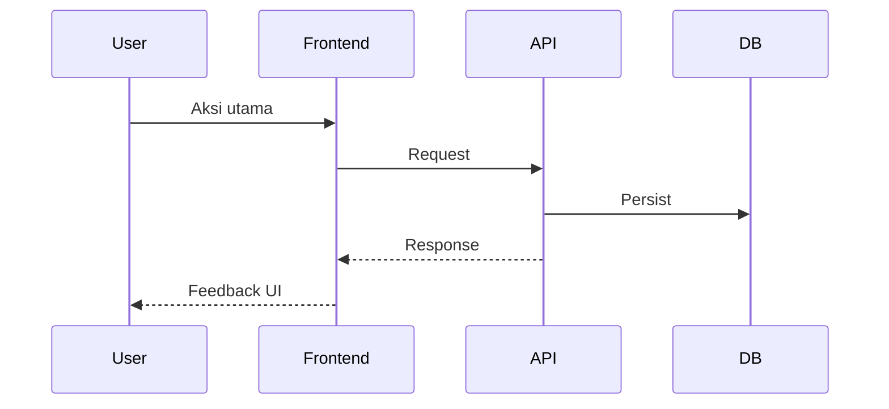

# [Nama fitur]

> Status: `draft` | `contract-ready` | `in-progress` | `done`  
> Tanggal: YYYY-MM-DD  
> Pemilik: —

## Ringkasan

Satu paragraf: masalah user, outcome, out of scope.

## Business flow

Urutan langkah bisnis (bukan teknis). Sertakan cabang error.



### Aturan bisnis

| ID | Aturan | Jika gagal |
|----|--------|------------|
| BR-1 | … | Pesan / kode error |

### Edge cases

- …

## API contract

Base: `/api/v1`. Headers: `Authorization`, `X-Workspace-ID` (lihat `TECHNICAL_SPEC.md` §5).

### Endpoints

#### `[METHOD] /path`

- **Auth**: `protected` | `admin` | public
- **Request** (JSON):

```json
{}
```

- **Response 200**:

```json
{ "success": true, "data": {} }
```

- **Errors**: `VALIDATION_ERROR`, `NOT_FOUND`, …

### Perubahan skema DB

- Migrasi: `backend/internal/migrate/migrations/NNNNNN_<nama>.up.sql`
- Tabel/kolom: …

## Frontend contract

| Route | Halaman | API |
|-------|---------|-----|
| `/…` | `…Page.tsx` | `frontend/src/api/….ts` |

### Types (sinkron dengan response `data`)

```ts
// export type …
```

### UI / design

- Shared: `PageShell`, `Field`, …
- Empty / error / loading: …

## Verifikasi

- [ ] `go build ./...` (backend)
- [ ] `npm run build` (frontend)
- [ ] Manual: happy path + 1 error path
- [ ] `TECHNICAL_SPEC.md` §5 + §20 diperbarui
- [ ] `cd frontend && graphify update .` / `cd backend && graphify update .` (folder yang berubah)

## Implementasi (centang saat selesai)

- [ ] Migrasi
- [ ] Repository + handler (+ service jika perlu)
- [ ] Route `main.go`
- [ ] `frontend/src/api/*`
- [ ] Pages + routing `App.tsx`
