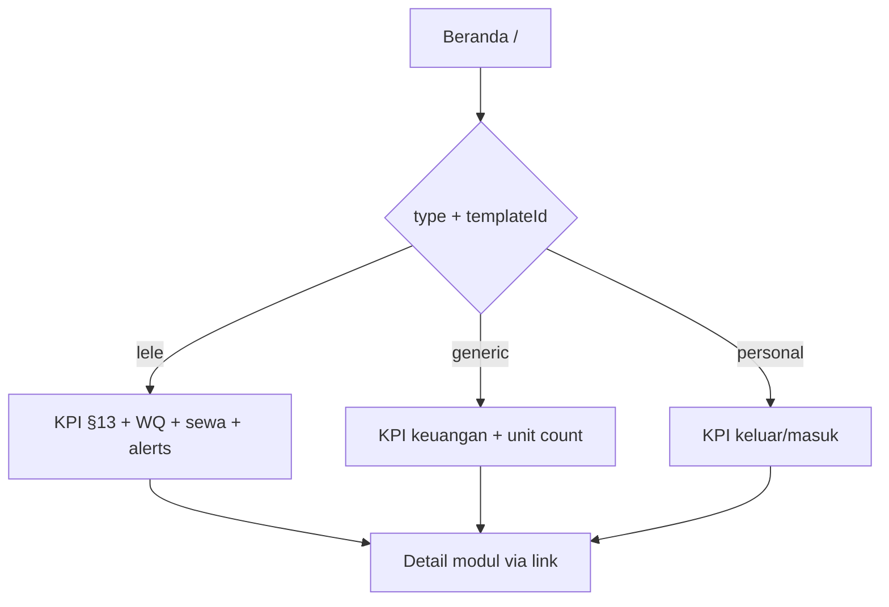

# Dashboard Beranda (per workspace)

| Field | Value |
|-------|--------|
| Status | `planning` — slice **DASH-WQ** ✅; sisanya mengikuti tabel § Planning |
| Tanggal | 2026-09-28 |
| Kanonik bisnis | [BRD §13](../../BRD.md#13-dashboard-metrics), [§8 personal](../../BRD.md#8-perilaku-workspace-personal-mvp), [FR-11](../../BRD.md#fr-11-dashboard) |
| Rencana eksekusi | [dashboard-implementation-plan.md](../superpowers/plans/2026-09-28-dashboard-implementation-plan.md) |

## Ringkasan

Beranda (`/`) menjawab **“apakah usaha/dompet saya sehat hari ini?”** tanpa CRUD. Data selalu scoped **`workspace_id`** + **membership**; tampilan mengikuti **`workspaces.type`** dan **`template_id`** (`lele` \| `generic` \| `personal`).

**Sudah live:** widget **kualitas air** (template `lele`) via `GET /dashboard` + `DashboardPage` (stat kolam, status per kolam, belum diukur hari ini, saran).

**Belum live (BRD §13):** kartu keuangan operasional, widget sewa/pakan, dashboard personal 2 kartu, dashboard generic (keuangan + ringkas unit). Ide analitik lanjutan (arus kas 30 hari, biaya per batch, audit feed) masuk **fase Plus** setelah MVP §13.

**Out of scope dokumen ini:** konsolidasi lintas workspace (lihat [workspace-consolidated-reports.md](./workspace-consolidated-reports.md)); CRUD di beranda; saldo kas tersimpan di kolom (saldo = agregat `transactions`, selaras BR-G).

---

## Prinsip produk (dari analisis + BRD)

1. **Hierarki:** Beranda = ringkasan + peringatan + CTA; detail di modul (Keuangan, Kolam, Laporan).
2. **Template-aware:** Satu route `/`, beberapa layout data (lihat matriks di bawah).
3. **Permission:** Bagian keuangan hanya jika user punya `finance.read` (atau subset); sewa butuh `finance.rent.read`; WQ butuh `water_quality.read`.
4. **Mobile-first:** KPI grid 2×2 di ponsel; chart di bawah fold; peringatan sebagai kartu tap-able.
5. **Empty state:** arahkan ke aksi pertama (tambah kolam / unit / catat transaksi), bukan chart kosong.
6. **Mata uang:** IDR, format FE `formatIDR` — mockup HTML lama memakai USD; **abaikan** untuk implementasi.

---

## Matriks tampilan per workspace

| Konteks | `type` | `template_id` | Seksi beranda (target) |
|---------|--------|---------------|-------------------------|
| Budidaya lele | BUSINESS | `lele` | Hero + **4 kartu §13** + widget WQ ✅ + widget sewa (rencana) + peringatan + link modul |
| Usaha umum | BUSINESS | `generic` | Hero + **kartu keuangan bulan** + jumlah unit aktif + CTA Keuangan/Unit (sebagian ✅ shell) |
| Pribadi | PERSONAL | `personal` | **2 kartu §8** (keluar/masuk) + CTA transaksi — **belum** |

Route modul lele (kolam, WQ, sewa) tetap diblokir di generic/personal lewat [workspace-template-generic.md](./workspace-template-generic.md) & `templates/registry.ts`.

---

## Kondisi repo saat ini

| Area | Implementasi | Gap ke BRD / visi |
|------|----------------|-------------------|
| API | `GET /dashboard` → hanya `waterQualitySummary[]`; middleware **template lele** | Tidak dipanggil untuk generic/personal; tidak ada KPI keuangan |
| API | `GET /finance/summary` → `monthPurchases`, `monthOtherExpenses`, `monthTotalOut` | Belum dipakai di beranda; tidak memecah Pakan/Sewa/Bagi hasil §13 |
| FE | `DashboardPage.tsx` | Lele: WQ only; generic: empty CTA; personal: sama seperti generic (belum 2 kartu) |
| Data | `payment_schedules`, `batches`, `purchase_line_items` | Belum ada agregasi dashboard (jadwal sewa, biaya batch) |
| Pakan aktif | `consumable_lots` | **Belum ada** — widget §13 “Pakan Aktif” menunggu MVP-05 |

---

## Business flow

1. User login dan memilih workspace di switcher.
2. Membuka **Beranda** (`/`).
3. FE menentukan layout dari `activeWorkspace.type` + `templateId`.
4. Satu atau beberapa request API dashboard (target: **satu** `GET /dashboard` terpadu).
5. UI menampilkan KPI, peringatan, dan widget sesuai permission; loading / error / empty state per seksi.



### Aturan bisnis

| ID | Aturan | Jika gagal |
|----|--------|------------|
| BR-D1 | Semua angka dashboard memakai periode default BRD §13 (bulan kalender WIB, tanggal 1–hari ini) kecuali query `from`/`to` eksplisit | — |
| BR-D2 | Saldo kas = derived dari transaksi (bukan kolom saldo di `cash_accounts`) bila kartu saldo ditampilkan | Dokumentasi BR-G |
| BR-D3 | Bagian sewa hanya workspace `template_id=lele` dan user punya `finance.rent.read` | Section omitted di JSON |
| BR-D4 | Bagian WQ hanya template `lele` + `water_quality.read` | Section omitted |
| BR-D5 | `OTHER_INCOME` hanya relevan workspace `PERSONAL` (dan nanti income penuh) | — |
| BR-D6 | Tidak menampilkan data workspace lain | Middleware membership existing |

### Edge cases

- Workspace baru tanpa transaksi/kolam: empty state + CTA, KPI = 0.
- User hanya `viewer`: KPI read-only, tanpa tombol catat.
- Generic tanpa unit: kartu unit = 0, tetap tampilkan keuangan jika `finance.read`.
- Backend slice belum deploy: FE boleh fallback `GET /finance/summary` + `getDashboardSummary` terpisah (hanya fase transisi).

---

## API contract (target — slice DASH-API-UNIFY)

Base: `/api/v1`. Auth: Bearer + `X-Workspace-ID` + membership.

### `GET /dashboard`

Query opsional: `from`, `to` (YYYY-MM-DD, WIB). Default: bulan berjalan.

**Auth:** semua user login (nav.dashboard tanpa permission). Field sensitif di-filter server-side by permission.

Response `data` (bentuk gabungan; field opsional per template/permission):

```json
{
  "period": { "from": "2026-09-01", "to": "2026-09-28" },
  "workspace": { "type": "BUSINESS", "templateId": "lele" },
  "finance": {
    "totalPurchases": 0,
    "totalFeed": 0,
    "totalRent": 0,
    "totalProfitShare": 0,
    "totalOtherExpense": 0,
    "totalIncome": 0,
    "transactionCount": 0
  },
  "operational": {
    "activePondCount": 0,
    "activeUnitCount": 0,
    "activeBatchCount": null
  },
  "waterQualitySummary": [],
  "rentAlerts": {
    "dueWithinDays": 30,
    "unpaidTotal": 0,
    "upcomingSchedules": []
  },
  "alerts": []
}
```

| Field | Template | Permission | Catatan |
|-------|----------|------------|---------|
| `finance.*` | semua (sesuai tipe transaksi workspace) | `finance.read` | §13 + personal |
| `waterQualitySummary` | `lele` | `water_quality.read` | **Sudah ada** (format existing) |
| `rentAlerts` | `lele` | `finance.rent.read` | Slice DASH-RENT-ALERTS |
| `operational.activeUnitCount` | `generic` | `operational_unit.read` | Slice DASH-GENERIC |
| `operational.activePondCount` | `lele` | `pond.read` | Opsional KPI |
| `alerts[]` | `lele` (+ generic finansial sederhana) | campuran | Slice DASH-ALERTS |

**Migrasi dari API lama:** Hapus guard `leleOnly` pada route `/dashboard`; handler memilih subset field by `template_id`. Endpoint `GET /finance/summary` tetap untuk halaman Keuangan.

**Errors:** `WORKSPACE_FORBIDDEN`, `INTERNAL_ERROR`.

---

## Frontend contract

| Route | Halaman | API (target) |
|-------|---------|----------------|
| `/` | `DashboardPage.tsx` | `GET /dashboard` (+ fallback sementara) |

### Struktur komponen (rencana)

| Komponen | Slice | Deskripsi |
|----------|-------|-----------|
| `DashboardHero` | DASH-FE-SHELL | Salam + tanggal + health (existing) |
| `DashboardFinanceKpiGrid` | DASH-FIN-KPI / DASH-PERSONAL / DASH-GENERIC | Kartu §13 / §8 |
| `DashboardWaterSection` | DASH-WQ ✅ | Stat + `PondStatusCard` list |
| `DashboardRentSection` | DASH-RENT-ALERTS | Tabel jadwal terdekat |
| `DashboardAlerts` | DASH-ALERTS | Kartu peringatan |
| `DashboardCharts` | DASH-CHARTS | Arus kas + donut kategori (Plus) |

File API baru: `frontend/src/api/dashboard.ts` (`getDashboard()`).

### UI / design

- Ikuti `mobile-first.mdc`, `design-system.mdc`, reuse `StatCard`, `PanelCard`, `EmptyState`, `alertInline`.
- Chart: library yang sudah dipakai di laporan WQ (jika ada) atau Chart.js lazy — slice DASH-CHARTS.
- Jangan duplikasi mockup HTML sidebar; pakai `AppLayout` existing.

---

## Planning implementasi (slice terpisah)

Setiap slice = satu PR / satu sesi agent. Detail checklist & urutan: [dashboard-implementation-plan.md](../superpowers/plans/2026-09-28-dashboard-implementation-plan.md).

| ID | Judul | Deliverable utama | Bergantung pada | Status |
|----|--------|-------------------|-----------------|--------|
| **DASH-WQ** | Kualitas air di beranda | `GET /dashboard` WQ + UI kolam | — | ✅ `done` |
| **DASH-FE-SHELL** | Layout per template | Refactor `DashboardPage` per template + permission gates | — | ⚠️ partial |
| **DASH-API-UNIFY** | Kontrak `GET /dashboard` terpadu | Handler + repo facade; buka route semua template | — | `draft` |
| **DASH-FIN-KPI** | Kartu keuangan §13 (lele) | Agregat PURCHASE, FEED line, RENT_PAYMENT, PROFIT_SHARE | DASH-API-UNIFY | `draft` |
| **DASH-PERSONAL** | Kartu personal §8 | OTHER_EXPENSE / OTHER_INCOME bulan ini | DASH-API-UNIFY, income MVP opsional | `draft` |
| **DASH-GENERIC** | Beranda usaha umum | KPI keuangan + `activeUnitCount` | DASH-API-UNIFY | `draft` |
| **DASH-RENT-ALERTS** | Jadwal sewa | `rentAlerts` + tabel FE | DASH-API-UNIFY, sewa ✅ | `draft` |
| **DASH-ALERTS** | Panel peringatan | Gabungan WQ belum ukur + sewa + data yatim | DASH-RENT-ALERTS, DASH-WQ | `draft` |
| **DASH-CHARTS** | Arus kas & kategori | Query harian 30d + donut bulan | DASH-FIN-KPI | Plus / `draft` |
| **DASH-BATCH** | Biaya per kolam/batch | Butuh batch UI + agregat `batch_id` | MVP-09 batch, DASH-API-UNIFY | Plus / `draft` |
| **DASH-FEED-WIDGET** | Pakan aktif | ConsumableLot | MVP-05 | blocked |

**Urutan disarankan:** `DASH-API-UNIFY` → paralel (`DASH-FIN-KPI`, `DASH-PERSONAL`, `DASH-GENERIC`) → `DASH-RENT-ALERTS` → `DASH-ALERTS` → Plus (charts, batch).

---

## Mapping ide analisis awal → slice

| Ide dokumen lama | Keputusan |
|------------------|-----------|
| Total saldo semua kas | Plus — butuh definisi saldo awal; BRD §13 tidak mensyaratkan kartu saldo (prioritas belanja/sewa) |
| Arus kas 30 hari | DASH-CHARTS |
| Widget peringatan sewa/WQ/transaksi yatim | DASH-ALERTS + DASH-RENT-ALERTS |
| Kartu kolam + batch + biaya | DASH-BATCH (batch belum di UI) |
| Tren WQ line chart | Tetap di `/water-quality/report` (RPT-07); beranda cukup snapshot + link |
| Breakdown kategori / top item | Overlap RPT-06; donut di DASH-CHARTS |
| Kalender sewa | DASH-RENT-ALERTS (tabel terdekat dulu) |
| Audit feed admin | RBAC fase 3 — bukan MVP dashboard |
| Sample HTML mockup | Referensi visual non-kanonik; lihat appendix |

---

## Appendix — referensi mockup HTML

Mockup statis (Chart.js, label USD) pernah disertakan sebagai inspirasi layout KPI + grid + panel peringatan. **Tidak** mengikat implementasi React. Untuk wireframe, gunakan struktur: 4 KPI → grid (chart \| alerts) → strip kolam → sewa \| donut.

---

## Verifikasi (saat slice selesai)

- [ ] `go build ./...` / `npm run build`
- [ ] Manual: tiga template workspace + personal + permission subset
- [ ] Update `TECHNICAL_SPEC.md` §5.11 & §20, BRD FR-11 / PART-DASH
- [ ] `graphify update` di folder yang berubah
