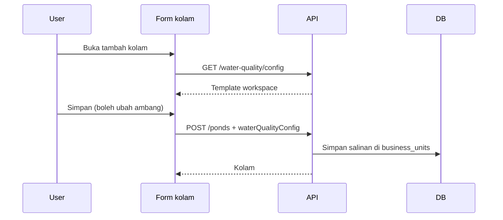

# Ambang kualitas air per kolam

> Status: `contract-ready`  
> Tanggal: 2026-09-23  
> Pemilik: —

## Ringkasan

Satu kolam biasanya satu spesies, jadi ambang amonia, batas pH, catatan analit, dan teks saran disimpan di kolam itu. Pengaturan usaha (`/water-quality/config`) tetap ada sebagai **template kolam baru**. Mengubah template tidak mengubah kolam yang sudah ada.

## Business flow

1. Admin mengatur template di Pengaturan → Kualitas Air (perilaku sekarang).
2. Pengguna membuka form kolam baru. Angka dan saran sudah terisi dari template.
3. Pengguna boleh mengubahnya, lalu simpan. Kolam menyimpan salinannya sendiri.
4. Ubah kolam memakai form yang sama, terisi dari data kolam (bukan template).
5. Catatan, pratinjau, dashboard, tren, dan laporan menilai tiap kolam dengan ambang kolam tersebut.



### Aturan bisnis

| ID | Aturan | Jika gagal |
|----|--------|------------|
| BR-1 | Kolam menyimpan `waterQualityConfig` lengkap | — |
| BR-2 | Create tanpa `waterQualityConfig` menyalin template workspace (sudah di-merge default) | — |
| BR-3 | Create/update dengan config: ambang > 0, bahaya ≥ waspada, pH maks ≥ min | `VALIDATION_ERROR` |
| BR-4 | Update tanpa field `waterQualityConfig` tidak mengubah ambang kolam | — |
| BR-5 | Mengubah template workspace tidak menulis ulang kolam yang sudah ada | — |
| BR-6 | Status dan saran log, ringkasan, tren, laporan, dan evaluate memakai config **kolam** | `NOT_FOUND` jika kolam tidak ada |
| BR-7 | `POST /water-quality/evaluate` wajib `businessUnitId` | `VALIDATION_ERROR` jika kosong |
| BR-8 | Kolam lama di-backfill sekali dari template workspace saat migrasi; yang belum punya baris settings memakai `DefaultConfig()` | — |
| BR-9 | Hak ubah kolam sama seperti sekarang: user login boleh create/update; hapus tetap admin | — |

### Edge cases

- Config JSON kosong atau field ≤ 0 di database: `MergeWithDefaults` saat dibaca.
- Tren tanpa filter kolam: tiap titik memakai ambang kolam pemilik log (butuh `business_unit_id` di query tren).
- Daftar log dari banyak kolam: evaluasi per `businessUnitId`, jangan satu config workspace.

## API contract

Base: `/api/v1`. Auth: Bearer. Workspace: `X-Workspace-ID`.

`WaterQualityConfig` tidak berubah bentuknya.

### Perubahan pond

`GET /ponds`, `GET /ponds/:id`, `POST /ponds`, `PUT /ponds/:id` menambah:

```json
"waterQualityConfig": {
  "ammoniaWarnPpm": 0.5,
  "ammoniaDangerPpm": 1,
  "phMinNormal": 6.5,
  "phMaxNormal": 8.5,
  "ammoniaAnalyteNote": "...",
  "advicePhLow": ["..."],
  "advicePhHigh": ["..."],
  "adviceAmmoniaWarn": ["..."],
  "adviceAmmoniaDanger": ["..."]
}
```

- **POST**: field opsional. Kosong → salin template workspace.
- **PUT**: field opsional. Tidak dikirim → biarkan nilai lama. Dikirim → validasi lalu ganti.

`GET/PUT /water-quality/config` tetap template workspace. Teks UI menjelaskan itu.

### Evaluate

`POST /water-quality/evaluate`

```json
{ "businessUnitId": "uuid", "ammoniaPpm": 0.8, "ph": 7.1 }
```

Response tetap `{ status, advice }` dari config kolam itu.

### Perubahan skema DB

Kolom `business_units.water_quality_config` JSON NULL.

Migrasi **idempoten di Go** (`migrate.Up`), bukan `ALTER` mentah di file `.up.sql`: runner mengeksekusi semua SQL setiap start, dan MySQL 8.4 tidak punya `ADD COLUMN IF NOT EXISTS`.

1. Tambah kolom jika belum ada (`information_schema`).
2. `UPDATE` baris yang `water_quality_config IS NULL`: salin `workspace_settings.water_quality_config`, atau JSON `DefaultConfig()` jika settings belum ada.
3. Jangan timpa nilai yang sudah terisi.

## Frontend contract

| Route | Halaman | API |
|-------|---------|-----|
| `/ponds/new` | `PondFormPage.tsx` | `GET /water-quality/config`, `POST /ponds` |
| `/ponds/:id/edit` | `PondFormPage.tsx` | `GET /ponds/:id`, `PUT /ponds/:id` |
| `/ponds` | `PondListPage.tsx` | daftar saja + tautan tambah |
| `/settings/water-quality` | `WaterQualityConfigPage.tsx` | template kolam baru |
| `/water-quality/new` | `WaterQualityFormPage.tsx` | hint + evaluate dari kolam terpilih |

Route `ponds/new` dan `ponds/:id/edit` didaftarkan sebelum `ponds/:id`.

### Types

`Pond.waterQualityConfig: WaterQualityConfig`

`createPond` / `updatePond` mengirim identitas + `waterQualityConfig`.

`evaluateWaterQuality({ businessUnitId, ammoniaPpm?, ph? })`.

### UI / design

- Form kolam: `PageShell` atau lebar `max-w-3xl`, `BackLink` ke `/ponds`, `PageHeader`, `MobileFormFooter` + `form` id, `pb-24`.
- Bagian 1: nama (wajib), lokasi, catatan, status (edit).
- Bagian 2: ambang + catatan analit + empat saran (satu langkah per baris), pola sama dengan halaman konfigurasi. Ekstrak helper baris saran supaya tidak disalin dua kali.
- Create: prefill dari template. Edit: prefill dari kolam.
- Daftar kolam: tombol Tambah kolam ke `/ponds/new`. Kartu punya tautan Ubah ke `/ponds/:id/edit`.
- Halaman konfigurasi: deskripsi bahwa ini template untuk kolam baru, bukan ambang yang dipakai penilaian.
- Form catatan: ambang dan pratinjau mengikuti kolam yang dipilih (`pond.waterQualityConfig`), evaluate mengirim `businessUnitId`.
- Judul header layout: Tambah Kolam / Ubah Kolam. `/ponds/:id/edit` bukan “Detail Kolam”.

## Verifikasi

- [ ] `go build ./...`
- [ ] `npm run build`
- [ ] `cd backend && graphify update .`
- [ ] `cd frontend && graphify update .`

## Implementasi

- [ ] Kolom + backfill idempoten
- [ ] Pond CRUD menyimpan config
- [ ] Evaluasi log/dashboard/tren/laporan/evaluate per kolam
- [ ] Form kolam + daftar + form catatan
