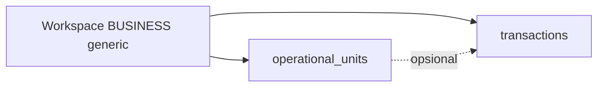

# Template workspace `generic`

| Field | Value |
|-------|--------|
| Status | `done` |
| Tanggal | 2026-09-28 |
| Desain | [generic-workspace-template-design.md](../superpowers/specs/2026-09-28-generic-workspace-template-design.md) |

## Ringkasan

Workspace usaha dengan `template_id = generic` memakai modul **Unit** (`operational_units`) dan menu keuangan/laporan shared. Modul lele (kolam, kualitas air, sewa) disembunyikan di UI dan ditolak di API (`TEMPLATE_NOT_SUPPORTED`).

Out of scope: ubah template workspace existing; template usaha selain `lele`/`generic`; dashboard khusus generic.

## Business flow

1. Admin buka **Kelola Akses → Workspace → Tambah**.
2. Pilih tipe **Usaha**, template **Usaha umum (generic)**.
3. Sistem membuat workspace + kas default; **tanpa** konfigurasi kualitas air.
4. User dengan membership switch ke workspace tersebut → sidebar: Beranda, Keuangan, **Unit** (bukan Kolam).
5. User kelola unit (cabang/lokasi/aktivitas) dan catat pembelian seperti biasa; opsional pilih unit di form pembelian.



### Aturan bisnis

| ID | Aturan | Jika gagal |
|----|--------|------------|
| BR-TG1 | Hanya workspace `BUSINESS` dengan `template_id = generic` yang memakai modul Unit | API modul lele/generic salah template → `403 TEMPLATE_NOT_SUPPORTED` |
| BR-TG2 | `template_id` ditetapkan saat create; tidak bisa diubah lewat `PUT /workspaces` | — (field tidak ada di update) |
| BR-TG3 | Create workspace `generic` tidak menulis `workspace_settings` kualitas air | — |
| BR-TG4 | Workspace `lele` tidak boleh memanggil `/operational-units` | `403 TEMPLATE_NOT_SUPPORTED` |
| BR-TG5 | Workspace `generic` tidak boleh memanggil `/ponds`, `/water-quality-logs`, `/rent-contracts`, `GET/PUT /water-quality/config` | `403 TEMPLATE_NOT_SUPPORTED` |

### Edge cases

- User tanpa `operational_unit.read` tidak melihat menu Unit meski template generic.
- Hapus unit yang masih direferensikan transaksi: FK `SET NULL` pada transaksi.
- Switch workspace dari lele ke generic di tengah sesi: redirect jika URL modul salah template.

## API contract

Base: `/api/v1`. Auth: Bearer. Membership: `X-Workspace-ID` + `RequireWorkspaceMembership`.

### Perubahan `POST /workspaces`

- Body: `templateId` boleh `"generic"` (selain `"lele"`, `"personal"`).
- Response: workspace dengan `templateId: "generic"`.
- Error lama dihapus: ~~Template usaha belum didukung~~ untuk nilai `generic`.

### Template guard (semua route modul)

Response jika template tidak cocok:

```json
{
  "success": false,
  "error": { "code": "TEMPLATE_NOT_SUPPORTED", "message": "Modul tidak tersedia untuk template workspace ini" }
}
```

HTTP **403**.

## Frontend contract

| Area | Perilaku |
|------|----------|
| `WorkspaceFormPage` | Opsi template: **Usaha umum (generic)** |
| `templates/registry.ts` | Definisi nav + blocked paths per `templateId` |
| `workspace-nav.ts` | Filter menu utama by `type` + `templateId` |
| `AppLayout` | Redirect route blocked (seperti personal) |
| Form pembelian | Jika `templateId === 'generic'`, select **Unit** (bukan kolam); field API `operationalUnitId` |

Routes baru Unit: lihat [operational-units.md](./operational-units.md).

Types: `frontend/src/api/workspace.ts` — `templateId` union atau string.

## UI / design

- Mobile-first: list unit kartu + FAB; form sticky submit (selaras `pond` pages).
- Label copy: **Unit** / **Tambah unit** (bukan Kolam).
- Dashboard Beranda generic: shell + CTA (slice **DASH-FE-SHELL** partial); KPI keuangan + unit → slice **DASH-GENERIC** di [dashboard.md](./dashboard.md).

## Status checklist implementasi

- [ ] Migrasi + ERD
- [ ] Backend template guard + `POST /workspaces`
- [ ] operational-units API
- [ ] Access catalog + sync
- [ ] FE registry + nav + workspace form
- [ ] Purchase optional unit link
- [ ] Build + graphify
