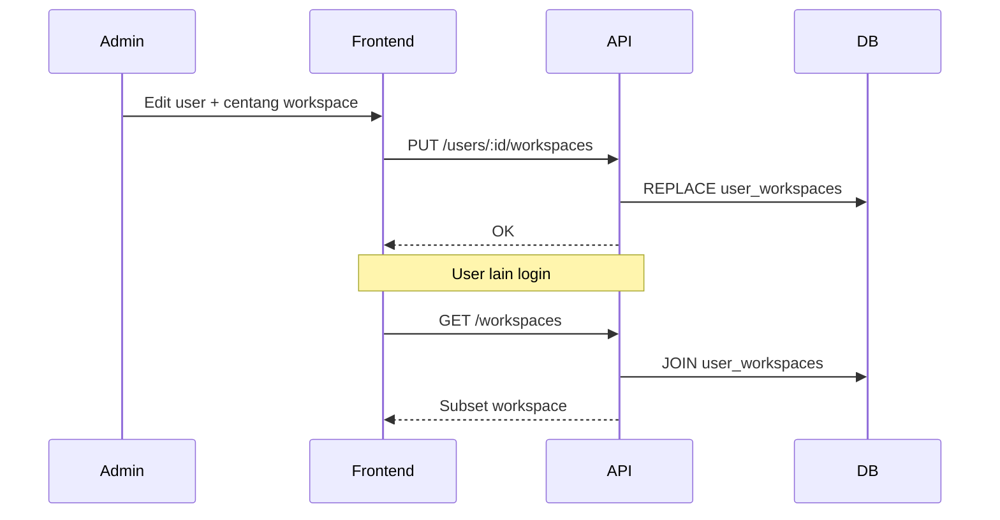

# Akses workspace per pengguna

> Status: `done`  
> Tanggal: 2026-09-28  
> Pemilik: —  
> Terkait: [workspace-switch.md](./workspace-switch.md), [rbac.md](./rbac.md), [multi-business design](../superpowers/specs/2026-09-28-multi-business-and-workspace-access-design.md)

## Ringkasan

`GET /workspaces` dan switcher UI hanya menampilkan workspace di **`user_workspaces`**. Request dengan `X-Workspace-ID` di luar membership → **403** `WORKSPACE_FORBIDDEN`. Admin assign lewat form pengguna (`user.assign_workspace`). Laporan konsolidasi usaha memakai subset workspace `BUSINESS` yang sama.

Terkait terpisah: [workspace-crud.md](./workspace-crud.md) (kelola master workspace), [workspace-consolidated-reports.md](./workspace-consolidated-reports.md). Out of scope: multi-tenant organisasi terpisah; role **per workspace** (role global, membership hanya gate akses).

## Business flow

1. Admin dengan `user.assign_workspace` membuka **Pengguna → edit/tambah**.
2. Admin mencentang workspace mana saja yang boleh diakses user (daftar dari `GET /workspaces`, difilter `BUSINESS` + opsional `PERSONAL` jika produk mengizinkan).
3. Simpan → baris `user_workspaces` di-update.
4. User login → `GET /auth/me` atau `GET /workspaces` hanya mengembalikan workspace yang di-assign.
5. User memilih workspace di switcher → request API memakai header; backend menolak jika tidak ada membership.



### Aturan bisnis

| ID | Aturan | Jika gagal |
|----|--------|------------|
| BR-WSA1 | User hanya melihat & memilih workspace yang punya baris `user_workspaces` | Daftar switcher kosong → pesan hubungi admin |
| BR-WSA2 | `X-Workspace-ID` tanpa membership untuk user tersebut | `403` `WORKSPACE_FORBIDDEN` |
| BR-WSA3 | Workspace tidak ada di DB | `404` `WORKSPACE_NOT_FOUND` (tetap sebelum cek membership) |
| BR-WSA4 | User aktif wajib punya **≥1** workspace ter-assign sebelum bisa operasional | Validasi saat simpan assignment |
| BR-WSA5 | Workspace `PERSONAL` boleh di-assign terpisah; tidak ikut laporan konsolidasi usaha (lihat design lintas bisnis) | — |
| BR-WSA6 | Menghapus user → cascade hapus `user_workspaces` | — |
| BR-WSA7 | Menghapus workspace → cascade hapus baris membership | — |
| BR-WSA8 | Migrasi awal: **backfill** semua user aktif ke semua workspace yang ada (perilaku lama) | — |

### Edge cases

- Admin mengosongkan semua centang → tolak simpan (BR-WSA4).
- User sudah login; admin cabut akses workspace aktif → request berikutnya `403`; FE redirect ke workspace pertama yang masih boleh atau `/forbidden`.
- `workspace_admin` **tidak** otomatis semua workspace kecuali di-backfill atau di-assign eksplisit (satu model, mudah diaudit).

## API contract

Base: `/api/v1`. Auth: Bearer JWT.

### Perubahan skema DB

Migrasi: `backend/internal/migrate/migrations/000009_user_workspaces.up.sql`

```sql
CREATE TABLE IF NOT EXISTS user_workspaces (
    user_id      CHAR(36)    NOT NULL,
    workspace_id CHAR(36)    NOT NULL,
    created_at   DATETIME(3) NOT NULL DEFAULT CURRENT_TIMESTAMP(3),
    PRIMARY KEY (user_id, workspace_id),
    FOREIGN KEY (user_id) REFERENCES users(id) ON DELETE CASCADE,
    FOREIGN KEY (workspace_id) REFERENCES workspaces(id) ON DELETE CASCADE,
    INDEX idx_user_workspaces_workspace (workspace_id)
);
```

Backfill (dalam migrasi yang sama):

```sql
INSERT INTO user_workspaces (user_id, workspace_id)
SELECT u.id, w.id FROM users u CROSS JOIN workspaces w
WHERE u.is_active = 1
ON DUPLICATE KEY UPDATE user_id = user_id;
```

### `GET /workspaces`

- **Auth**: JWT
- **Header**: `X-Workspace-ID` tidak wajib
- **Response**: hanya workspace dengan membership untuk `user_id` dari JWT
- **Permission**: login saja

### `GET /users/:id`

- Tambahan field di `data`:

```json
{
  "workspaceIds": ["uuid", "..."],
  "workspaces": [{ "id", "name", "type", "templateId" }]
}
```

- **Permission**: `user.read`

### `PUT /users/:id/workspaces`

- **Permission**: `user.assign_workspace`
- **Request**:

```json
{ "workspaceIds": ["uuid1", "uuid2"] }
```

- **Validasi**: setiap id ada di `workspaces`; array tidak kosong; semua UUID valid
- **Response 200**: sama seperti GET user (termasuk `workspaceIds`)
- **Errors**: `VALIDATION_ERROR`, `NOT_FOUND` (user/workspace)

### `POST /users`

- Opsional body `workspaceIds`; jika kosong/omit → default **semua workspace BUSINESS** saat ini (atau wajib isi — pilih saat implement: **wajib minimal 1** direkomendasikan).

### `GET /auth/me`

- Tambahan opsional (disarankan):

```json
{
  "workspaceIds": ["..."],
  "defaultWorkspaceId": "uuid"
}
```

`defaultWorkspaceId`: workspace `BUSINESS` pertama (urutan nama) atau terakhir dipakai di localStorage (hanya FE).

### Middleware

Urutan setelah `Auth`:

1. `ValidateWorkspace` — workspace ada (404)
2. **`RequireWorkspaceMembership`** — `user_id` + `X-Workspace-ID` ada di `user_workspaces` (403)

Kecuali: `GET /workspaces`, `/auth/*`, route tanpa header workspace (sama seperti hari ini).

### Permission baru (access catalog)

| Kode | Label | Dipakai di |
|------|-------|------------|
| `user.assign_workspace` | Atur akses workspace pengguna | Form user, `PUT .../workspaces` |

Tambahkan ke `shared/access-catalog.json` di halaman pengguna (aksi assign), seed `workspace_admin`; **bukan** default operator.

## Frontend contract

| Route | Perubahan |
|-------|-----------|
| `/users/new`, `/users/:id/edit` | Section **Akses workspace** — checkbox semua workspace (nama + tipe) |
| Switcher | Daftar dari `GET /workspaces` (sudah terfilter server) |
| `403 WORKSPACE_FORBIDDEN` | Toast + reset ke workspace valid / logout |

| File | Tugas |
|------|--------|
| `frontend/src/api/users.ts` | Types `workspaceIds`, `setUserWorkspaces` |
| `frontend/src/pages/UserFormPage.tsx` | UI checkbox + validasi minimal 1 |

### UI / design

- Mobile-first: daftar checkbox dalam `PanelCard`, label workspace + badge `Usaha` / `Pribadi`.
- Tanpa akses `user.assign_workspace`: section disembunyikan; hanya tampil read-only daftar workspace (jika `user.read`).

## Testing (arah)

- Integration: user A hanya workspace W1 → `GET /ponds` dengan header W2 → 403.
- Backfill migrasi: user lama tetap lihat semua workspace seed.

## Status implementasi

| Lapisan | Status |
|---------|--------|
| Migrasi + repo | ✅ `000009_user_workspaces` |
| Middleware membership | ✅ `RequireWorkspaceMembership` |
| User API + handler | ✅ `PUT /users/:id/workspaces`, `GET /workspaces/all` |
| Access catalog + seed | ✅ `user.assign_workspace` |
| UserFormPage | ✅ checkbox akses workspace |
