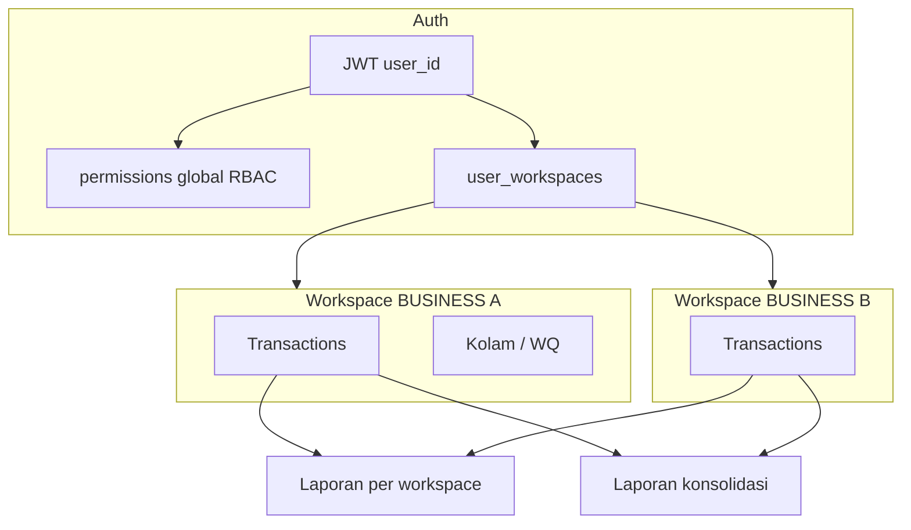

# Desain: lintas bisnis, workspace, dan akses pengguna

| Field | Value |
|-------|--------|
| Tanggal | 2026-09-28 |
| Status | Fase 1–4 ✅ — [generic template](./2026-09-28-generic-workspace-template-design.md) |
| Konteks produk | [BRD](../../BRD.md), [ERD](../../database/ERD.md) |

## 1. Masalah

### 1.1 Bisnis

Pemilik atau pengelola menjalankan **lebih dari satu usaha** (mis. dua unit pemijahan lele hari ini; warung atau budidaya lain nanti). Pencatatan operasional dan keuangan harus **terpisah per usaha** agar tidak tercampur, tetapi pemilik juga perlu **gambaran gabungan** pengeluaran usaha (bukan dompet pribadi).

### 1.2 Produk saat ini

| Area | Kondisi |
|------|---------|
| Data | Semua entitas scoped `workspace_id` ✅ |
| Switch workspace | UI + header API ✅ |
| Jenis usaha | `template_id` (`lele`); modul kolam/WQ/sewa spesifik budidaya |
| User ↔ workspace | **Tidak ada** — semua user melihat semua workspace |
| Laporan | Hanya workspace aktif (`X-Workspace-ID`) |
| Personal | Workspace `PERSONAL` terpisah; belum income penuh |

### 1.3 Risiko tanpa perbaikan

- Operator usaha A bisa melihat/mengubah data usaha B.
- Laporan “total” tidak terdefinisi; agregasi manual di luar sistem.
- Menambah jenis usaha tanpa **template** membuat menu operasional membingungkan.

## 2. Prinsip solusi

1. **Workspace tetap unit isolasi data** — tidak menggabungkan transaksi antar workspace di satu tabel “campuran”.
2. **Membership eksplisit** — `user_workspaces` menentukan siapa boleh masuk workspace mana ([workspace-user-access.md](../../features/workspace-user-access.md)).
3. **Dua lapisan laporan**
   - **Per workspace** — seperti sekarang (RPT-01…06, operasional template).
   - **Konsolidasi usaha** — agregasi hanya workspace `BUSINESS` yang user punya akses; **personal tidak ikut** (keputusan produk 2026-09-28).
4. **Template usaha** — `workspaces.template_id` mengarahkan modul operasional (menu, form, master). Engine keuangan (`Transaction`, kas) tetap shared.

## 3. Arsitektur (target)

### 3.1 Komponen

| Unit | Tanggung jawab |
|------|----------------|
| `user_workspaces` | Many-to-many user ↔ workspace |
| `GET /workspaces` | Filter by membership |
| Middleware membership | 403 jika header workspace tidak di-assign |
| User form | Assign workspace (permission `user.assign_workspace`) |
| `GET /reports/consolidated/summary` (fase 2) | Agregat `Transaction` lintas workspace BUSINESS yang boleh diakses user |
| Template registry (fase 3) | `template_id` → modul menu & validasi (lele vs generic) |

## 4. Lintas bisnis — template & modul

| `template_id` | Modul operasional | Laporan khusus |
|---------------|-------------------|----------------|
| `lele` | Kolam, kualitas air, sewa kolam | RPT sewa, WQ |
| `generic` (future) | Master unit generik, tanpa WQ | Hanya laporan keuangan shared |
| `personal` | Subset transaksi | RPT-P |

Workspace baru `BUSINESS` memilih template saat create (`POST /workspaces`, `templateId` default `lele`) — lihat [workspace-crud.md](../../features/workspace-crud.md).

## 5. Laporan keuangan konsolidasi (fase 2 — ringkas)

**Masalah:** Pemilik ingin total belanja / per tipe transaksi **semua usaha** dalam periode yang sama.

**Solusi:**

- Endpoint baru **tanpa** `X-Workspace-ID` wajib; query `workspaceIds` opsional (default = semua BUSINESS yang user punya membership).
- Agregasi SQL: `SUM(amount)` per `transaction_type` + breakdown per `workspace_id` + `grandTotal`.
- **Tidak** menggabungkan line item RPT-01 lintas workspace di MVP konsolidasi (opsional fase 3).
- FE: menu **Laporan → Ringkasan semua usaha** (permission `finance.read` + minimal 2 workspace BUSINESS untuk bernilai).

Spesifikasi implementasi: [workspace-consolidated-reports.md](../../features/workspace-consolidated-reports.md).

## 6. Urutan implementasi disarankan

| Fase | Deliverable | Dokumen |
|------|-------------|---------|
| **1** | `user_workspaces` + filter `/workspaces` + middleware + form user | [workspace-user-access.md](../../features/workspace-user-access.md) |
| **2** | Laporan konsolidasi ringkas | [workspace-consolidated-reports.md](../../features/workspace-consolidated-reports.md) ✅ |
| **3** | CRUD workspace + pilih template | [workspace-crud.md](../../features/workspace-crud.md) ✅ |
| **4** | Template `generic` + `operational_units` | [generic-workspace-template-design.md](./2026-09-28-generic-workspace-template-design.md) · [workspace-template-generic.md](../../features/workspace-template-generic.md) |

## 7. Keputusan terkunci

| # | Keputusan |
|---|-----------|
| K1 | Konsolidasi keuangan = hanya workspace `BUSINESS` yang user punya akses |
| K2 | Personal tidak masuk total gabungan usaha |
| K3 | Akses workspace eksplisit di DB; tidak ada “superuser bypass” tanpa baris (admin di-backfill) |
| K4 | RBAC permission tetap global; membership hanya membatasi **workspace mana** |

## 8. Dampak dokumen kanonik

- [BRD.md](../../BRD.md) — FR-01, FR-02, aturan BR-H
- [TECHNICAL_SPEC.md](../../TECHNICAL_SPEC.md) — §5.2, users, middleware
- [ERD.md](../../database/ERD.md) — tabel `user_workspaces`
- [workspace-switch.md](../../features/workspace-switch.md) — BR-WS2 diganti membership
- [rbac.md](../../features/rbac.md) — permission `user.assign_workspace`
- [.cursor/rules/backend-dry-solid.mdc](../../.cursor/rules/backend-dry-solid.mdc) — scope data per membership
